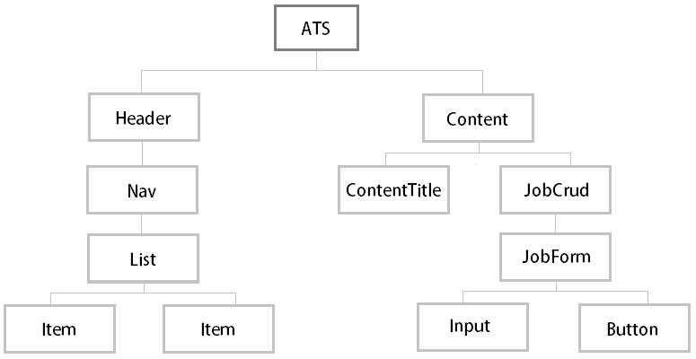

# ATS MVP

Inicialmente eu pensei numa estrutura para um CRUD de candidatos, porém acabei optando por desenvolver um **CRUD de vagas**, que também é uma das funcionalidades de um *Applicant Tracking System*.

## Back-end com JSON Server

Usarei JSON server para construir a **API Rest** onde serão guardadas as informações de vagas. 

`npm init -y` para criar o package.json

`npm i json-server` para iniciar o JSON server

Para isso, criei um arquivo `db.json` para armazenar os endpoints da API. Criei três jobs mockados para testar a API no Postman. Para isso, criei um script de `start` no `package.json` para que o JSON server suba na porta :3001, já que o Angular sobe servidor na porta :4200.

Testados os métodos GET e PUT no Postman, segui com o desenvolvimento. 

## Front-end com Angular 12

Versão do Angular CLI utilizada no projeto: 12.2.10.

Versão NPM utilizada no projeto: 6.14.9.

Criação do projeto: `ng new ats --skip-install`.

Ajustes no `package.json` conforme documentação do **PO UI**.

Instalação de dependências: `npm install`.

Adição do pacote `@po-ui/ng-components`: `ng add @po-ui/ng-components`

Execução da aplicação em servidor local: `ng serve`

Desabilitei o modo estrito em `tsconfig.json` pois isso me gerou alguns erros de compilação em outros projetos anteriores.

Criei um arquivo `index.ts` em cada diretório usando a ideia do método Barrel, para otimizar as exportações dos componentes.

### Árvore de Componentes

### Importação de biblioteca UI

Minha ideia era utilizar o PO UI neste projeto para começar a me familiarizar, até já havia feita a sua instalação no projeto, porém devido a curva de aprendizado acabei optando por utilizar o Material para elaborar o layout. 🙁

Executei o comando `ng add @angular/material` no terminal para efetuar a instalação do Material. Tomei a liberdade de escolher o tema Indigo/Pink e também optei pela tipografia global e pela configuração de animações do Material.

------

## Execução da aplicação

Para rodar o JSON serve localmente, execute o seguinte comando no terminal: `npm start`

Acesse `http://localhost:3001/` no navegador. 

Para executar a aplicação localmente, execute o seguinte comando no terminal: `ng serve`

Acesse `http://localhost:4200/` no navegador. 

Para executar testes unitários da aplicação via [Karma](https://karma-runner.github.io), execute o seguinte comando no terminal: `ng test`

Uma página se abrirá automaticamente (Google Chrome) indicando o resultado dos testes.

Para gerar versão de produção da aplicação, execute o seguinte comando no terminal: `ng build`.  Com isso a versão estará disponível na pasta `dist/`.
